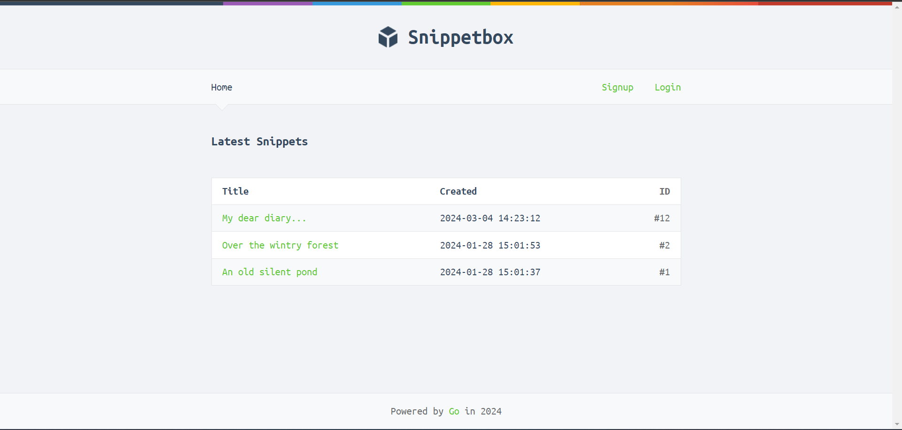

# Full-stack Web Application on Go 

Это полноценное фуллстэк веб приложение, которое позволяет пользователям работать с текстовыми фрагментами (подобно GitHub Gists)

### Features

- Аутенфикация. Пользователи могут регистрироваться и авторизовываться
- Protected endpoints. Только зарегестрированные пользователи могут создавать и удалять сниппеты
- RESTful routing.
- Middleware.
- MySQL database.
- SSL/TLS web server using HTTP 2.0.
- CRUD operations
- Генерирование HTML страниц с помощью шаблонов Golang.

### Development

##### `go run cmd/web/*`

Starts the local web server with HTTPS on port 4000 ([https://localhost:4000](https://localhost:4000))
